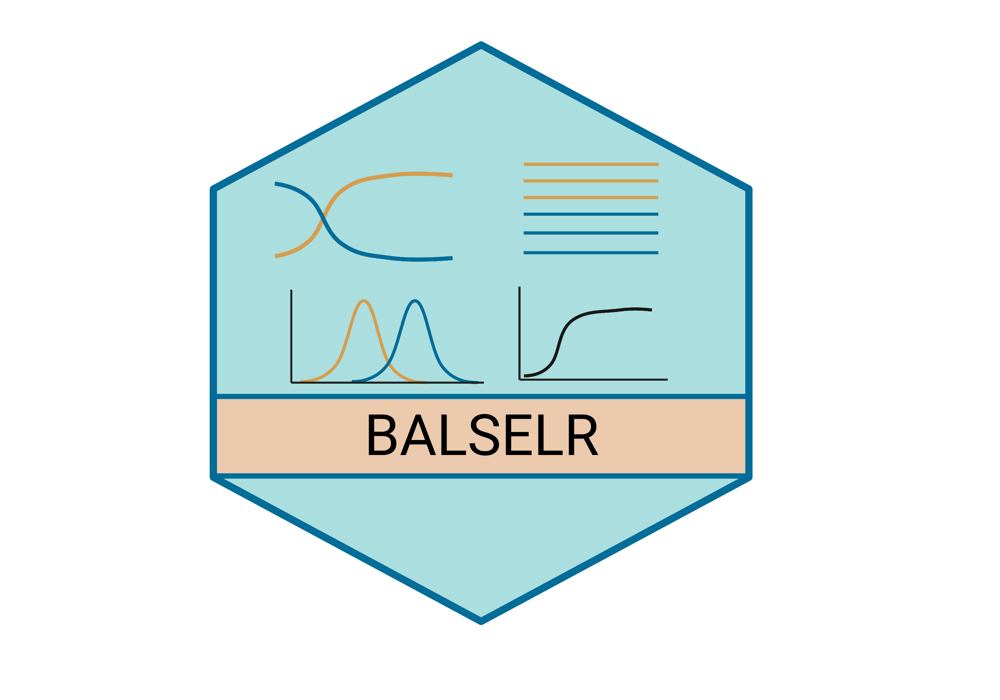

<!-- README.md is generated from README.Rmd. Please edit that file -->

```{r, include = FALSE}
knitr::opts_chunk$set(
        collapse = TRUE,
        comment = "#>",
        fig.path = "man/figures/README-",
        out.width = "100%"
)
```

# balselr


<!-- badges: start -->
{width=40% height=40%}
[](https://github.com/bitarellolab/balselr/actions/workflows/R-CMD-check.yaml)
[](https://app.codecov.io/gh/bitarellolab/balselr?branch=master)
<!-- badges: end -->

### What is `balselr`?

Balancing selection with R allows you to run **NCD statistics** to detect **long-term balancing selection** in genomic datasets.

Original paper describing the NCD statistics: Bitarello, De Filippo, Teixeira, Schmidt,  Kleinert, Meyer & Andrés (2018). Signatures of long-term balancing selection in human genomes. Genome biology and evolution, 10(3), 939-955. [link](https://academic.oup.com/gbe/article/10/3/939/4938688)

## Installation

You can install the development version of balselr from [GitHub](https://github.com/) with:

``` r
# install.packages("devtools")
library(devtools)
devtools::install_github("bitarellolab/balselr")
library(balselr)
```


## Example

This is a basic example which shows you how to read in a vcf file:

```{r, echo=T, eval=F}
read_vcf(x=system.file(package = "balselr", "example.vcf"))
```

This is an example which shows how to parse a vcf file and output an input file for `ncd1`:

```{r, echo=T, eval=F}
parse_vcf(
        infile = system.file(package = "balselr", "example.vcf"),
        n0 = 108,
        type = "ncd1"
)
```

This is an example which shows how to parse a vcf file and output an input file for `ncd2`:

```{r, echo=T, eval=F}
parse_vcf(
        infile = system.file(package = "balselr", "example.vcf"),
        n0 = 108,
        n1 = 2,
        type = "ncd2"
)
```


Run `ncd1 (tf=0.5)` with a 3000 basepair window and a minimum of 8 informative sites per window using 2 cores:

```{r, echo=T, eval=F}
data(ncd1_input)
ncd1(x=ncd1_input, tf=0.5, w=3000, ncores=2, minIS=8)
```


Run `ncd2 (tf=0.5)` with a 3000 basepair window and a minimum of 2 informative sites per window using 2 cores:

```{r, echo=T, eval=F}
data(ncd2_input)
ncd2(x=ncd2_input, tf=0.5, w=3000, ncores=2, minIS=2)
```


