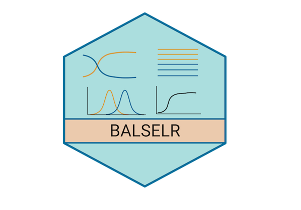

<!-- README.md is generated from README.Rmd. Please edit that file -->

# balselr

<!-- badges: start -->


<!-- badges: end -->

## Installation

You can install the development version of balselr from
[GitHub](https://github.com/) with:

``` r
# install.packages("devtools")
library(devtools)
devtools::install_github("bitarellolab/balselr")
library(balselr)
```

## Example

This is a basic example which shows you how to read in a vcf file:

``` r
read_vcf(x="inst/example.vcf")
```

This is an example which shows how to parse a vcf file and output an
input file for `ncd1`:

``` r
parse_vcf(infile=system.file(package="balselr", "example.vcf"), n0=108, type="ncd1")
```

This is an example which shows how to parse a vcf file and output an
input file for `ncd2`:

``` r
parse_vcf(infile=system.file(package="balselr", "example.vcf"), n0=108, n1=2, type="ncd2")
```

Run `ncd1 (tf=0.5)` with a 3000 basepair window and a minimum of 8
informative sites per window using 2 cores:

``` r
ncd1(x=ncd1_input, tf=0.5, w=3000, ncores=2, minIS=8)
```

You’ll still need to render `README.Rmd` regularly, to keep `README.md`
up-to-date. `devtools::build_readme()` is handy for this. You could also
use GitHub Actions to re-render `README.Rmd` every time you push. An
example workflow can be found here:
<https://github.com/r-lib/actions/tree/v1/examples>.
